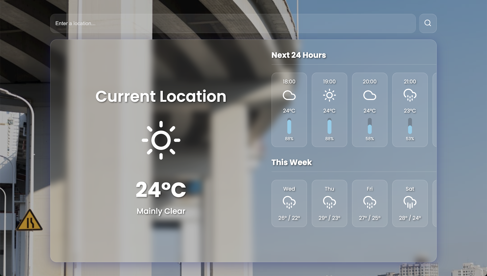

# 🔮 Crystal Cast: 날씨 웹 앱



## 💡 프로젝트 소개

**Crystal Cast**는 순수 HTML, CSS, JavaScript로 만든 날씨 웹 앱입니다. 글래스모피즘 디자인을 적용했고, 날씨에 따라 배경 이미지와 아이콘이 동적으로 변합니다.

## ✨ 주요 기능

*   **현재 날씨**: 현재 위치나 검색 도시의 실시간 온도, 날씨 설명, 아이콘 표시.
*   **시간대별 예보**: 다음 24시간 동안 시간별 기온, 날씨 아이콘, 강수 확률 그래프 제공.
*   **주간 예보**: 이번 주 최고/최저 기온과 날씨 아이콘을 한눈에 파악.
*   **위치 검색**: 도시 이름으로 전 세계 날씨 검색.
*   **자동 위치 감지**: 검색어 없으면 현재 위치 날씨 자동 표시.
*   **동적 배경**: 날씨에 맞는 Unsplash 고품질 배경 이미지 자동 전환.
*   **검색 초기화**: 검색창 'X' 버튼으로 내용 지우고 현재 위치 날씨 재표시.
*   **반응형 디자인**: 다양한 화면 크기에서 최적화된 레이아웃.
*   **로딩 스피너**: 데이터 로딩 중 스피너 표시.
*   **빠른 이미지 로딩**: 배경 이미지 로딩 속도 향상.

## 🛠️ 사용한 기술들

*   **HTML5**: 웹 페이지 구조.
*   **CSS3**: 디자인, 반응형, 애니메이션.
*   **JavaScript (ES6+)**: 동적 기능 구현.
*   **Feather Icons**: 깔끔한 SVG 아이콘.
*   **Open-Meteo API**: 날씨 데이터.
*   **Nominatim OpenStreetMap API**: 위치 지오코딩.
*   **Unsplash API**: 배경 이미지.
*   **Google Fonts**: Poppins 폰트.

## 🚀 직접 실행해보기

이 프로젝트를 여러분의 컴퓨터에서 직접 실행하고 싶다면 아래 단계를 따르십시오.

### **준비물**

1.  **웹 브라우저**: 최신 버전.
2.  **Unsplash Access Key**: Unsplash 개발자 사이트에서 발급.

### **설치 및 실행 방법**

1.  **코드 가져오기 (클론)**:
    ```bash
    git clone https://github.com/YOUR_USERNAME/YOUR_REPOSITORY_NAME.git
    cd YOUR_REPOSITORY_NAME
    ```
    (위 `YOUR_USERNAME`과 `YOUR_REPOSITORY_NAME`을 실제 GitHub 사용자명과 저장소 이름으로 바꾸십시오!)

2.  **API 키 설정**:
    프로젝트 폴더 안에 `config.js` 파일을 만들고, 발급받은 Unsplash Access Key를 아래처럼 넣으십시오.
    ```javascript
    // config.js
    const UNSPLASH_ACCESS_KEY = '여기에_여러분의_Unsplash_Access_Key를_넣으십시오';
    ```
    **꼭 확인하십시오:** `여기에_여러분의_Unsplash_Access_Key를_넣으십시오` 부분을 실제 키로 바꿔야 합니다!

3.  **실행**:
    `index.html` 파일을 웹 브라우저로 드래그해서 열면 앱이 바로 실행됩니다!

## 🔑 API 키 안전하게 사용하기 (GitHub Pages 배포 시)

이 프로젝트는 Unsplash API 키를 사용합니다. GitHub Pages 같은 곳에 올릴 때 좀 더 안전하게 관리하는 방법이 있습니다.

1.  **Unsplash에서 도메인 제한 걸기:**
    *   Unsplash 개발자 대시보드에 가서, 여러분의 Access Key가 `https://<여러분의-GitHub-사용자명>.github.io` (또는 여러분이 쓰는 다른 도메인)에서만 작동하도록 설정하십시오.

2.  **GitHub Secrets에 키 숨기기:**
    *   GitHub 저장소 `Settings` > `Secrets and variables` > `Actions`로 들어가서, `UNSPLASH_ACCESS_KEY`라는 이름으로 여러분의 Unsplash Access Key를 저장하십시오.

3.  **`.gitignore`에 `config.js` 다시 추가하기:**
    *   `config.js` 파일이 실수로 Git 저장소에 올라가지 않도록 `.gitignore`에 `config.js`를 추가하십시오.
    ```
    # .gitignore
    config.js
    ```

4.  **GitHub Actions로 자동 배포 설정:**
    *   프로젝트 폴더 안에 `.github/workflows/deploy.yml` 파일을 만들고 아래 내용을 넣으십시오. 이 워크플로우는 여러분이 코드를 `main` 브랜치에 푸시될 때마다 GitHub Secrets에서 키를 가져와 `config.js`를 만들고, 자동으로 GitHub Pages에 배포할 것입니다.

    ```yaml
    # .github/workflows/deploy.yml
    name: GitHub Pages로 배포하기

    on:
      push:
        branches:
          - main

    jobs:
      build-and-deploy:
        runs-on: ubuntu-latest

        steps:
        - name: 코드 가져오기
          uses: actions/checkout@v4

        - name: API 키로 config.js 파일 만들기
          run: |
            echo "const UNSPLASH_ACCESS_KEY = '${{ secrets.UNSPLASH_ACCESS_KEY }}';" > config.js
          env:
            UNSPLASH_ACCESS_KEY: ${{ secrets.UNSPLASH_ACCESS_KEY }}

        - name: GitHub Pages 설정
          uses: actions/configure-pages@v4

        - name: 배포할 파일 업로드
          uses: actions/upload-pages-artifact@v3
          with:
            path: './'

        - name: GitHub Pages에 배포
          id: deployment
          uses: actions/deploy-pages@v4
    ```

5.  **GitHub Pages 설정 확인:**
    *   GitHub 저장소 `Settings` > `Pages`에서 `Source`를 `Deploy from a branch`, `Branch`를 `gh-pages` (또는 `main`)로 설정하십시오.

## 🤝 함께 만들어가요!

이 프로젝트는 오픈 소스입니다. 버그 보고, 기능 제안, 코드 개선에 참여하고 싶다면 언제든지 환영합니다.

1.  저장소를 포크(Fork)하십시오.
2.  새로운 브랜치를 만들고 작업하십시오.
3.  변경 내용을 커밋하십시오.
4.  여러분의 브랜치에 푸시하십시오.
5.  그리고 풀 리퀘스트(Pull Request)를 보내십시오!

## 📄 라이선스

이 프로젝트는 MIT 라이선스를 따릅니다. 자세한 내용은 `LICENSE` 파일을 참고하십시오.

## 🙏 고마운 분들

*   [Open-Meteo](https://open-meteo.com/)
*   [Nominatim OpenStreetMap](https://nominatim.openstreetmap.org/)
*   [Unsplash](https://unsplash.com/)
*   [Feather Icons](https://feathericons.com/)
*   [Google Fonts](https://fonts.google.com/)